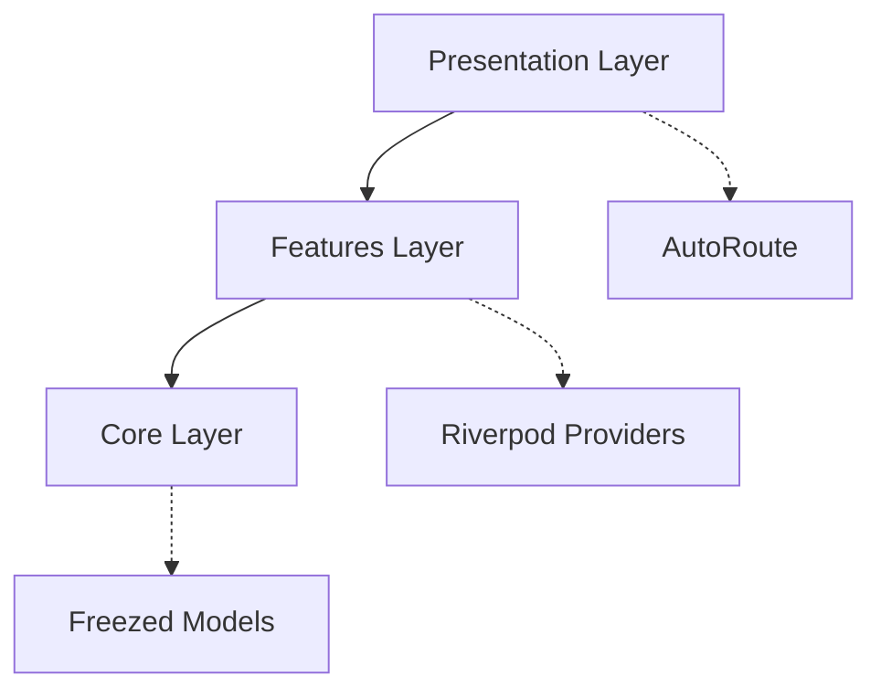

# Kimapp Template AI Documentation

## Template Variables
```yaml
project_name: # snake_case - Sets root package name and import paths
sentry_dsn:   # optional - Sentry DSN for error monitoring
```

## Code Generation Rules
### File Patterns
| Pattern            | Generators                          | Location               |
|--------------------|-------------------------------------|------------------------|
| `**_provider.dart` | Riverpod + Kimapp Form Generator    | `features/**/providers`|
| `**_model.dart`    | Freezed + JSON Serialization        | `features/**/models`   |
| `**_page.dart`     | AutoRoute Page Generation           | `presentation/modules` |

## Architecture Constraints


### Allowed AI Operations
```diff
+ Add new provider methods with @riverpod
+ Create UI components in presentation/modules
+ Extend helper classes in core/helpers

- Modify freezed model definitions
- Alter build.yaml configurations
- Change router guard logic
```

## State Management Standards
```dart
// Preferred provider pattern
@riverpod
class ExampleProvider extends _$ExampleProvider {
  @override
  Future<ExampleModel> build() async {
    return _fetchData();
  }
  
  // AI-safe modification example
  Future<void> refreshData() async {
    state = const AsyncValue.loading();
    state = await AsyncValue.guard(_fetchData);
  }
}
```

## Validation Checks
```bash
# Pre-generation validation script
flutter pub run build_runner build --check
```

## AI Interaction Example
```prompt
Generate user profile feature with:
- StateNotifierProvider pattern
- profile_page.dart in presentation/modules
- profile_provider.dart using @riverpod
- Follow TEMPLATE_AI_README.md guidelines
```

[//]: # (AI_METADATA
{
  "template_version": "0.1.0",
  "last_updated": "2025-01-22",
  "required_generators": [
    "kimapp_generator:^0.1.0",
    "riverpod_generator:^2.6.1"
  ]
}
)